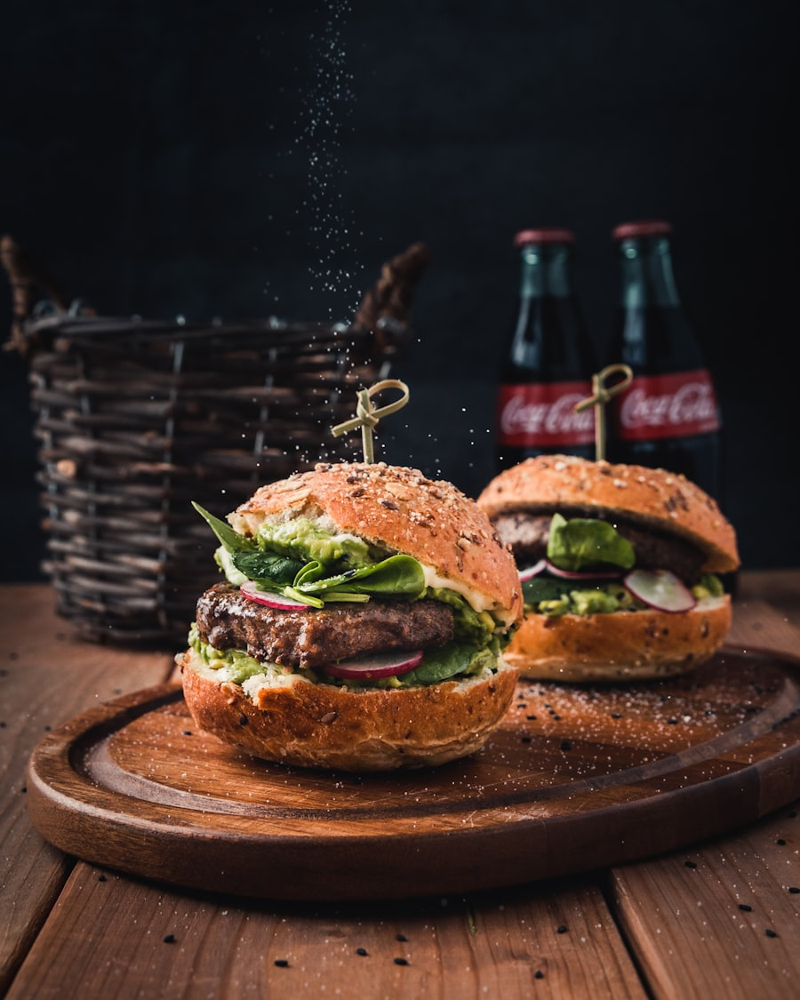

# Swiggy-clone
Swiggy Clone is a food delivery web app that allows users to browse restaurants, view menus, place orders, and track deliveries online. It includes features like user login, cart system, payment options, and real-time order updates for a smooth experience.
#Output
 https://srihema28.github.io/Swiggy-clone/

 <!DOCTYPE html>
<html lang="en">
<head>
  <meta charset="UTF-8" />
  <meta name="viewport" content="width=device-width, initial-scale=1.0" />
  <title>Swiggy-Style Food Delivery – Pro Version</title>
  <link rel="preconnect" href="https://fonts.googleapis.com">
  <link rel="preconnect" href="https://fonts.gstatic.com" crossorigin>
  <link href="https://fonts.googleapis.com/css2?family=Inter:wght@300;400;500;600;700;900&display=swap" rel="stylesheet">
  
</head>
<body>
<header>
  <nav class="nav">
    

TT
 Tasty Time

    

    

      <a href="#restaurants">Restaurants</a>
      <a href="#categories">Categories</a>
      <a href="#about">About</a>
      <a href="#offers">Offers</a>
      <button class="btn btn-primary" onclick="openAuth()">Login / Sign up</button>
      <button class="btn" onclick="openCart()">🛒 Cart</button>
    

  </nav>
</header>

<section class="hero">
  

    <h1>Fast. Fresh. Delivered to your door.</h1>
    
Explore restaurants, track orders live and enjoy exclusive offers.

    

      <input id="search" placeholder="Search for dishes or restaurants...">
      <button class="btn btn-primary" onclick="searchRestaurants()">Search</button>
    

  

  

    
  

</section>

<section class="section" id="offers">
  <h2>🔥 Best Offers Today</h2>
  

    

<strong>50% OFF on Pizzas</strong>
Use code: PIZZA50

    

<strong>Buy 1 Get 1 Burgers</strong>
Weekend special

    

<strong>Buy 1 Get 1 Desserts</strong>
Weekend special

    

<strong>Buy 1 Get 1 Biriyani</strong>
Weekend special

    

<strong>Buy 1 Get 1 Noodles</strong>
Weekend special

    

<strong>50% OFF on veg meels</strong>
60% OFF

    

<strong>50% OFF on Chicken 65</strong>
60% OFF

    

<strong>50% OFF on Shawarma</strong>
60% OFF

  
 
</section>

<section class="section" id="categories">
  <h2>Popular Categories</h2>
  

    
    

<strong>50% OFF on Pizzas</strong>
Use code: PIZZA50

    

<strong>Buy 1 Get 1 Burgers</strong>
Weekend special

    

<strong>Buy 1 Get 1 Desserts</strong>
Weekend special

    

<strong>Buy 1 Get 1 Biriyani</strong>
Weekend special

    

<strong>Buy 1 Get 1 Noodles</strong>
Weekend special

    

<strong>50% OFF on veg meels</strong>
60% OFF

    

<strong>50% OFF on Chicken 65</strong>
60% OFF

    

<strong>50% OFF on Shawarma</strong>
60% OFF

  

</section>

<section class="section" id="restaurants">
  <h2>Top Restaurants Near You</h2>
  

</section>

<section class="section" id="about">
  <h2>About Us</h2>
  
We are a modern food delivery platform focused on speed, quality and customer happiness.

</section>

<!-- Cart page section -->
<section class="section">
  

    <h2>Your Cart</h2>
    

    
<strong>Total:</strong> ₹0

    <button class="btn btn-primary">Proceed to Checkout</button>
  

</section>

<!-- Authentication modal -->

  

    <h3>Login / Sign up</h3>
    <input placeholder="Email">
    <input type="password" placeholder="Password">
    <button class="btn btn-primary" style="width:100%">Continue</button>
    
<a href="#" onclick="closeAuth()">Close</a>

  

<footer>
  

    <h3>Swiggy-Style Pro</h3>
    
Complete, professional front-end with pages, cart and authentication UI.

  

</footer>

</body>
</html>

